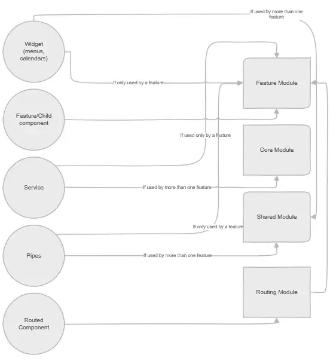
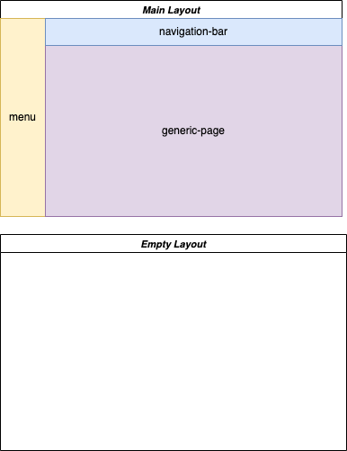
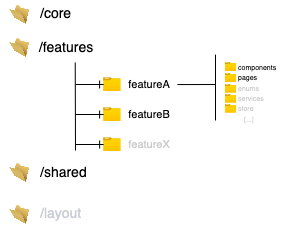
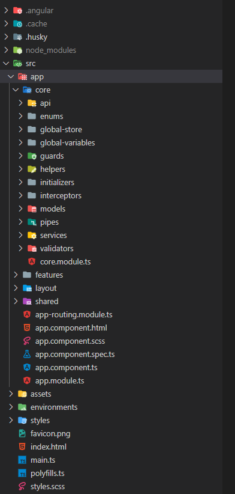

<div style="width: 100%;">
  
</div>

## Introduction
These are my **personal** notes about Angular, Typescript and everything in between. I hope they are useful for you. Fully opinionated with my experience.


## Table of Contents
- General
1. [Commands](#commands)
2. [Basics](#basics)

- Advanced

3. [Best practices](#best-practices)
4. [Architecture](#architecture)
5. [Q&A](#q&a)
6. [Tools](#coding-tools)

## Commands ([Angular CLI](https://angular.io/cli))

Use this commands inside an angular project.

| Command                               | Description                             | Notes                                                                                                                                                                             |
| ------------------------------------- | --------------------------------------- | --------------------------------------------------------------------------------------------------------------------------------------------------------------------------------- |
| `ng new {appName} --{flagName}`       | Create a new angular project            | Useful flags:<br/> - Create project without tests`--skip-tests`<br/> - Specify a prefix for your entire app `--prefix {prefixName}`<br/>- Create the app with routing `--routing` |
| `ng serve `                           | Run your angular project                | Useful flags: <br/>Open the browser: `-o` <br/>Specify a port `--port 666`                                                                                                        |
| `ng generate {type} {name} {options}` | Generate new angular code automatically | Types: - component - service - module - pipe - class - interface - enum - directive - guard - service-worker - ...                                                                |
| `ng build`                            | Build your angular project              | Useful flags: <br/>Build for production `--prod`                                                                                                                                  |
| `ng test`                             | Test your angular project               |                                                                                                                                                                                   |
| `ng update`                           | Update your angular project             |                                                                                                                                                                                   |
| `ng version`                          | Outputs Angular CLI version             |                                                                                                                                                                                   |

## Basics

If you are new into Angular please visit the basics page to know how to installed, what you need and many more.

## Architecture

The architecture is one of the most important aspects of any application. There are many ways one can structure an Angular app. Every design decision has its own set of benefits and draw-backs. Let's take a look at the following diagram of the final architecture we want to achieve.

<p align="center">
  
</p>

Let's explore the different parts

- **CORE**: The things that are absolutely essential for the app to start. Core directory is the place where we should put singleton services, injection tokens, constants, app configurations, pipes, interceptors, guards, auth service, utils, etc. that will be used across the suite.
  > Services that are specific to a feature can go in the feature folder.
- **FEATURES**: are all organized into their own folder, they’re all self-contained and everything it’s pretty easy to find for that given feature. Business features live in this `features` directory. The idea is to make a module per feature. That module can contain components, directives, pipes, services, interfaces, enums, utils, and so on. The concept is to keep things close.
  > `Feature` modules shouldn't be dependant on other modules other than the services provided by `CoreModule` and features exported by `SharedModule`
- **SHARED**: Consider `shared` directory module as a mini-library for the UI components or for third-party components. They are not specific to a single business feature. They should be super dumb that you can take all the components, drop in another angular project, and expect to work (given the dependencies are met). This module can be then imported to each feature module.
  > Do not make a giant `SharedModule`, rather granularize each atomic feature into its own module.
  
  > I'm my last projects I've been used `standalone components` to create my `ui-library` or `shared` folder


If you have any doubt of where something goes:

<p align="center">
  
</p>

### Personal architecture tips

Personally in my latests projects on top of previous characteristics I add a couple of layyers. This totally depends on the requirements of the specific application that you wanna build.

- **API LAYER**: contains all the _API-related_ files in a folder called `API` inside `core` folder. The idea is that only the files related to the back-end will live inside that folder

  - These services will have no business logic, their responsibility will only be to call the backend, do data transformations and return the data.
  - There should be one service per controller under a folder with the name of the module
  - The name of the service should be `ControllerName+ ApiService` and the `fileName` `controller-name.api.service.ts`
  - In the folder `core/api/api-routes` we are going to create one file per module with all the **routes** of that module. The name of that file would be `featureX-api.routes.ts`

- **LAYOUT**: If you have an app where you repeat the layout I strongly recommend you to create an extra feature, called `layout`, that contains the `main-layout` (shared a across al the app) and the `empty-layout` (parts of the app the doesn't requiere a layout such as the login)
  > The idea with the `main-layout` is to load the content of each page inside that layout that contains, for example, a common menu and a navigation bar that are repeated accross the entire app.

<p align="center">
  
</p>

- Sometimes I also differenciate between **components** and **pages**. For angular are exactly the same but I create a folder inside each lazy feature, one for _pages_ and one per _components_. “Page” is just terminology to identify a component that is being used as a route. Each route of the feature module has a page under `/page` folder.

Example:

<p align="center">
  
</p>

<p align="center">
  
</p>

#### 🔗 Key links

- [Build an epic architecture in Angular](https://tomastrajan.medium.com/how-to-build-epic-angular-app-with-clean-architecture-91640ed1656)
- [Planning the architecture of your angular app](https://itnext.io/planning-the-architecture-of-your-angular-app-a4840bfec13b)
- [Angular guide architecture](https://angular.io/guide/architecture)


## Coding tools

Collection of extensions/plugins/misc that I use for coding angular

- Browser extension for your favorite browser. More info [here](https://angular.io/guide/devtools)
- If you are using any state management library in Angular you might encounter useful the [Redux dev tools extension](https://chrome.google.com/webstore/detail/redux-devtools/lmhkpmbekcpmknklioeibfkpmmfibljd?hl=es). Again is available in any browser.
- For coding I'm using [visual studio code](https://code.visualstudio.com/). Some extensions:
  - [Angular Language service](https://marketplace.visualstudio.com/items?itemName=Angular.ng-template)
  - [Alpha order](https://marketplace.visualstudio.com/items?itemName=ue.alphabetical-sorter)

 
Go to [Snippets page](./topics/AngularSnippets.md) for more info.
### License

This source content is licensed under the _Creative Commons Attribution 4.0 International_ - see the [LICENSE](LICENSE.md) for details.

---

Feel free to propose improvements via pull request. Authored and maintained by [Adrián Aguado](https://github.com/aguadotzn). Copyright © 2023.

> For any inquiries, you can contact me on [Twitter](https://twitter.com/aguadotzn).


<details> 
  <summary>Create component</summary>
  
  You can use the CLI. `ng g c nameComponent`
```typescript
  @Component({
    selector: 'selector-name',
    templateUrl: 'name.component.html',
  })
  export class NameComponent implements OnInit {
    constructor() {}
    ngOnInit() {}
}
```
</details>


<div style="width: 100%;">
        <a href="topics/Basics">

  
  </a>
</div>
